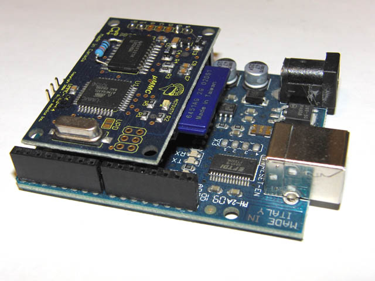
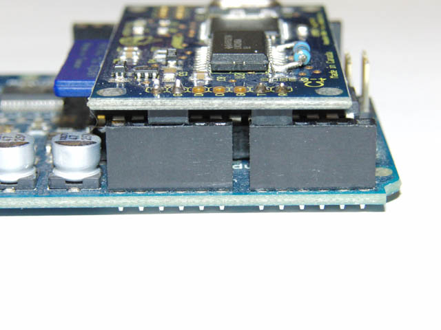




## Description

Here's how you can use the uMMC as a simple shield on an Arduino Duemilanove.

The uMMC connects to +5V and GND, and pins 14 and 15 (also known as A0 and A1, or Analog pins 0 and 1).

You will need to put header pins on the uMMC shown below.





And here is how you set it up:

```cpp
#include "RogueSD.h"
#include "NewSoftSerial.h"

NewSoftSerial ummc_s(14, 15);
RogueSD ummc(ummc_s);
```

