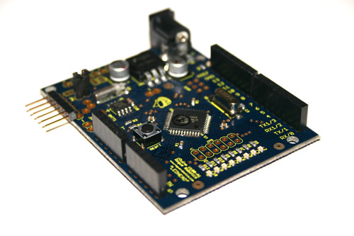
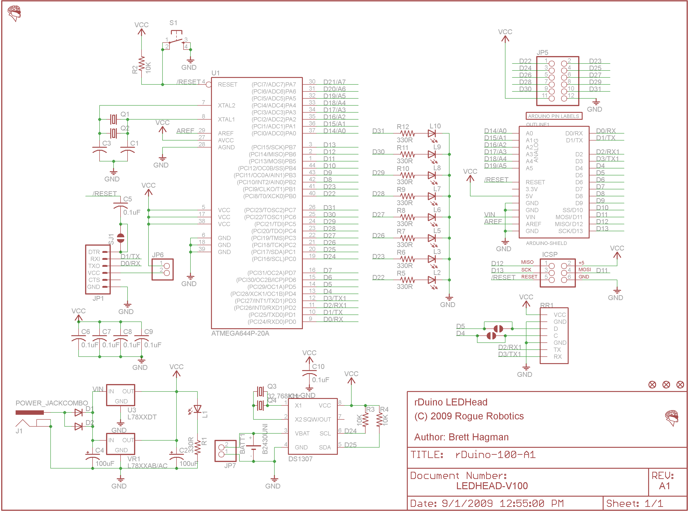
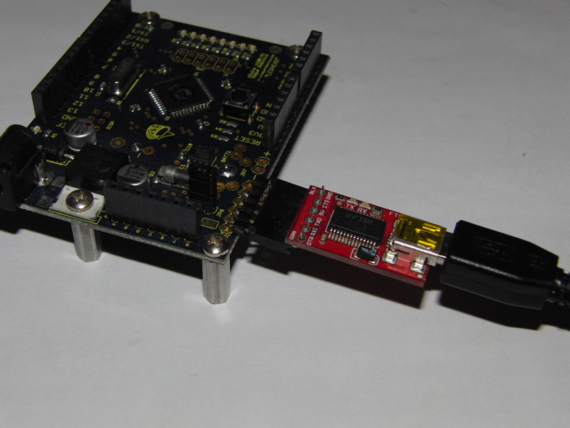




[{: width="250px"}](photos.html)

  * rDuino LEDHead Product Page - Discontinued
  * [GC Downloads](http://code.google.com/p/rogue-code/downloads/list?can=1&q=Tag-rDuino) (Arduino&trade; IDE hardware core)

**Note:** This documentation is outdated, and is here for reference only. We no longer manufacture the rDuino LEDHead.
{: .notice--warning}

## Downloads

You need to download the "core" to be able to compile code for the rDuino LEDHead in the Arduino IDE.

Download the core here: [rDuino LEDHead core](http://rogue-code.googlecode.com/files/ArduinoCore-rDuinoLEDHead.zip)

## Installation Instructions

### Arduino IDE version 0018+

Unzip the core to the "hardware" folder of your sketchbook folder.

e.g. Your sketchbook folder is: `C:\Arduino\sketchbook`

  * make a folder named "`hardware`" in the `sketchbook` folder, if it doesn't already exist:
    * `C:\Arduino\sketchbook\hardware`
  * unzip the rDuino core into the `hardware` folder, resulting in:
    * `C:\Arduino\sketchbook\hardware\**rDuino**`

## Overview

The rDuino LEDHead is a microcontroller board based on the ATmega644P. It has 32 digital input/output pins (of which 6 can be used as PWM outputs), 8 analog inputs (6 accessible on headers), a 16 MHz crystal oscillator, a battery backed RTC (battery not included), 8 user controlled LEDs, a power jack, an ICSP header, and a reset button. It contains everything needed to support the microcontroller; simply connect it to a computer with a USB cable (such as the SparkFun™ FTDI Basic Breakout - 5V [DEV-09115]) or power it with a AC-to-DC adapter or battery to get started.

## Summary

|                          |  Features  |
|--------------------------|:-----------|
|Operating Temperature   |  -40°C to +85°C  |
|Power Source              |  5 Volts Regulated or 7 → 12V DC Jack  |
|On-board Regulator        |  7805 - 5 Volts, 1 Amp  |
|Provides 3.3V Supply      |  No  |
|MCU                       |  Atmel ATmega644P  |
|Oscillator                |  16 MHz   |
|Flash Memory Total        |  65536 bytes (64 KiB)  |
|Flash Memory Available    |  63488 bytes (62 KiB)  |
|SRAM                      |  4096 bytes (4 KiB)  |
|EEPROM                    |  2048 bytes (2 KiB)  |
|Digital I/O Pins          |  32 (of which 6 provide PWM output)  |
|Analog Input Pins         |  8  |
|DC Current per I/O Pin    |  40 mA  (200 mA MAX total)  |
|Hardware Serial Ports     |  2  |
|DS1307 RTC On-board       |  Yes  |
|LEDs On-board             |  8  |
|USB Serial On-board       |  No  |
|Arduino IDE compatible    |  Yes (core download required)  |

## Schematic

## Power

The rDuino LEDHead can be powered via the USB connection or with an external power supply.  You should not use power from both at the same time (jumper JP6 takes the power from the USB connection, and should be removed if the USB connection and the external power supply are used at the same time).

External (non-USB) power can come either from an AC-to-DC adapter (wall-wart) or battery. The adapter can be connected by plugging a 2.1mm center-positive plug into the board's power jack. Leads from a battery can be inserted in the Gnd and Vin pin headers of the POWER connector.

The board can operate on an external supply of 6 to 20 volts. If supplied with less than 7V, however, the 5V pin may supply less than five volts and the board may be unstable. If using more than 12V, the voltage regulator may overheat and damage the board. The recommended range is 7 to 12 volts.

The power pins are as follows:

  * VIN. The input voltage to the board when it's using an external power source (as opposed to 5 volts from the USB connection or other regulated power source). You can supply voltage through this pin, or, if supplying voltage via the power jack, access it through this pin.
  * 5V. The regulated power supply used to power the microcontroller and other components on the board. This can come either from VIN via an on-board regulator, or be supplied by USB or another regulated 5V supply.
  * 3V3. This power pin is provided ONLY for compatibility to other Arduino boards, and is NOT powered by the LEDHead board.  Again, no power comes from this pin on the rDuino LEDHead.
  * GND. Ground pins. 

## Memory

The ATmega644P has 64 KiB of flash memory for storing code (of which 2 KiB is used for the bootloader).  The ATmega644P has 4 KiB of SRAM and 2 KiB of EEPROM (which can be read and written with the EEPROM library).

## Input and Output

Each of the 32 digital pins on the LEDHEad can be used as an input or output, using `pinMode()`, `digitalWrite()`, and `digitalRead()` functions. They operate at 5 volts. Each pin can provide or receive a maximum of 40 mA and has an internal pull-up resistor (disconnected by default) of 20-50 kOhms. In addition, some pins have specialized functions:

  * Serial: 0 (RX) and 1 (TX). Used to receive (RX) and transmit (TX) TTL serial data. These pins are connected to the corresponding pins of the USB connection, used to communicate externally or upload sketch code.
  * Serial1: 2 (RX) and 3 (TX). Used to receive (RX) and transmit (TX) TTL serial data.  This hardware serial port is free for use.
  * External Interrupts: 2 and 3. These pins can be configured to trigger an interrupt on a low value, a rising or falling edge, or a change in value. See the attachInterrupt() function for details.  The external interrupts can not be used at the same time as Serial1.
  * PWM: 4, 5, 6, 7, 9, 10. Provide 8-bit PWM output with the analogWrite() function.
  * SPI: 10 (SS), 11 (MOSI), 12 (MISO), 13 (SCK). These pins support SPI communication.
  * LEDs: 22, 23, 26, 27, 28, 29, 30, 31.  There are 8 built-in LEDs connected these digital pins. When the pin is HIGH value, the LED is on, when the pin is LOW, it's off.  You'll notice that the pins jump from 23 to 26.  This is because pins 24 and 25 are used for TWI (aka I2C).

The rDuino LEDHead has 8 analog inputs, each of which provide 10 bits of resolution (i.e. 1024 different values). By default they measure from ground to 5 volts, though is it possible to change the upper end of their range using the AREF pin and the `analogReference()` function. Additionally, some pins have specialized functionality:

  * I2C: 24 (SCL) and 25 (SDA). Support I2C (TWI) communication using the Wire library. 

There are a couple of other pins on the board:

  * AREF. Reference voltage for the analog inputs. Used with `analogReference()`.
  * Reset. Bring this line LOW to reset the microcontroller. Typically used to add a reset button to shields which block the one on the board. 

## Pin Mapping

|  Arduino                       ||  ATmega644P (TQFP44) ||  |
|:------------:|:-----------------|:------------:|:-----|:--------|
|  **Pin Number**  |**Function**         |  **Pin Number**  |**Name**  |  **Notes**  |
|:------------:|:-----------------|:------------:|:-----|:--------|
|  0   |Digital Pin 0/RX0         |  9   |PD0/RXD0       | Serial  |
|  1   |Digital Pin 1/TX0         |  10  |PD1/TXD0       | Serial  |
|  2   |Digital Pin 2/RX1         |  11  |PD2/RXD1/INT0  | Serial1  |
|  3   |Digital Pin 3/TX1         |  12  |PD3/TXD1/INT1  | Serial1  |
|  4   |Digital Pin 4/PWM         |  13  |PD4/OC1B/XCK1  | |
|  5   |Digital Pin 5/PWM         |  14  |PD5/OC1A       | |
|  6   |Digital Pin 6/PWM         |  15  |PD6/OC2B/ICP   | |
|  7   |Digital Pin 7/PWM         |  16  |PD7/OC2A       | |
|  8   |Digital Pin 8/INT2        |  42  |PB2/INT2/AIN0  | |
|  9   |Digital Pin 9/PWM         |  43  |PB3/OC0A/AIN1  | |
|  10  |Digital Pin 10/PWM        |  44  |PB4/OC0B/SS    | SPI  |
|  11  |Digital Pin 11/MOSI       |  1   |PB5/MOSI       | SPI  |
|  12  |Digital Pin 12/MISO       |  2   |PB6/MISO       | SPI  |
|  13  |Digital Pin 13/SCK        |  3   |PB7/SCK        | SPI  |
|  14  |Digital Pin 14/Analog 0   |  37  |PA0/ADC0       | |
|  15  |Digital Pin 15/Analog 1   |  36  |PA1/ADC1       | |
|  16  |Digital Pin 16/Analog 2   |  35  |PA2/ADC2       | |
|  17  |Digital Pin 17/Analog 3   |  34  |PA3/ADC3       | |
|  18  |Digital Pin 18/Analog 4   |  33  |PA4/ADC4       | |
|  19  |Digital Pin 19/Analog 5   |  32  |PA5/ADC5       | |
|  20  |Digital Pin 20/Analog 6   |  31  |PA6/ADC6       | **Not accessible on board**  |
|  21  |Digital Pin 21/Analog 7   |  30  |PA7/ADC7       | **Not accessible on board**  |
|  22  |Digital Pin 22            |  40  |PB0/T0/XCK0    | LED0  |
|  23  |Digital Pin 23            |  41  |PB1/CLKO/T1    | LED1  |
|  24  |Digital Pin 24            |  19  |PC0/SCL        | TWI/I2C  |
|  25  |Digital Pin 25            |  20  |PC1/SDA        | TWI/I2C  |
|  26  |Digital Pin 26            |  21  |PC2/TCK        | LED2  |
|  27  |Digital Pin 27            |  22  |PC3/TMS        | LED3  |
|  28  |Digital Pin 28            |  23  |PC4/TDO        | LED4  |
|  29  |Digital Pin 29            |  24  |PC5/TDI        | LED5  |
|  30  |Digital Pin 30            |  25  |PC6            | LED6  |
|  31  |Digital Pin 31            |  26  |PC7            | LED7  |
|  AREF  |Analog Reference        |  29  |AREF           | |
|  RESET  |Reset                  |  4   |RESET          | |

## Communication

The rDuino LEDHead has a number of facilities for communicating with a computer, another Arduino, or other microcontrollers. The ATmega644P provides dual UART TTL (5V) serial communication, which is available on digital pins 0 (RX0), 1 (TX0), 2 (RX1), and 3 (TX1).

The SoftwareSerial and NewSoftSerial libraries allows for serial communication on any of the LEDHead's digital pins.

The ATmega644P also supports I2C (TWI) and SPI communication. The Arduino software includes a Wire library to simplify use of the I2C bus; see the documentation for details. To use the SPI communication, please see the ATmega644P datasheet.

## Programming

The rDuino LEDHead can be programmed with the Arduino software ([download](http://arduino.cc/en/Main/Software)). See the above download/installation information for configuring the Arduino software to work with the rDuino LEDHead.

The ATmega644P on the rDuino LEDHead comes preburned with a bootloader that allows you to upload new code to it without the use of an external hardware programmer. It communicates using the original STK500 protocol.

You can also bypass the bootloader and program the microcontroller through the ICSP (In-Circuit Serial Programming) header; see [these instructions](http://arduino.cc/en/Hacking/Programmer) for details.

## Automatic (Software) Reset

Rather then requiring a physical press of the reset button before an upload, the rDuino LEDHead is designed in a way that allows it to be reset by software running on a connected computer.  When this line is asserted (taken low), the reset line drops long enough to reset the chip. The Arduino software uses this capability to allow you to upload code by simply pressing the upload button in the Arduino environment. This means that the bootloader can have a shorter timeout, as the lowering of DTR can be well-coordinated with the start of the upload.

This setup has other implications. When the rDuino LEDHead is connected to either a computer running Mac OS X or Linux, it resets each time a connection is made to it from software (via USB). For the following half-second or so, the bootloader is running on the LEDHead. While it is programmed to ignore malformed data (i.e. anything besides an upload of new code), it will intercept the first few bytes of data sent to the board after a connection is opened. If a sketch running on the board receives one-time configuration or other data when it first starts, make sure that the software with which it communicates waits a second after opening the connection and before sending this data.

The rDuino LEDHead contains a trace that can be cut to disable the auto-reset.  The pads on either side of the trace can be soldered together to re-enable it.

## Physical Characteristics

The maximum length and width of the rDuino LEDHead PCB are 2.7 and 2.1 inches respectively, with the USB connector and power jack extending beyond the former dimension. Three screw holes allow the board to be attached to a surface or case. Note that the distance between digital pins 7 and 8 is 160 mil (0.16"), not an even multiple of the 100 mil spacing of the other pins.
