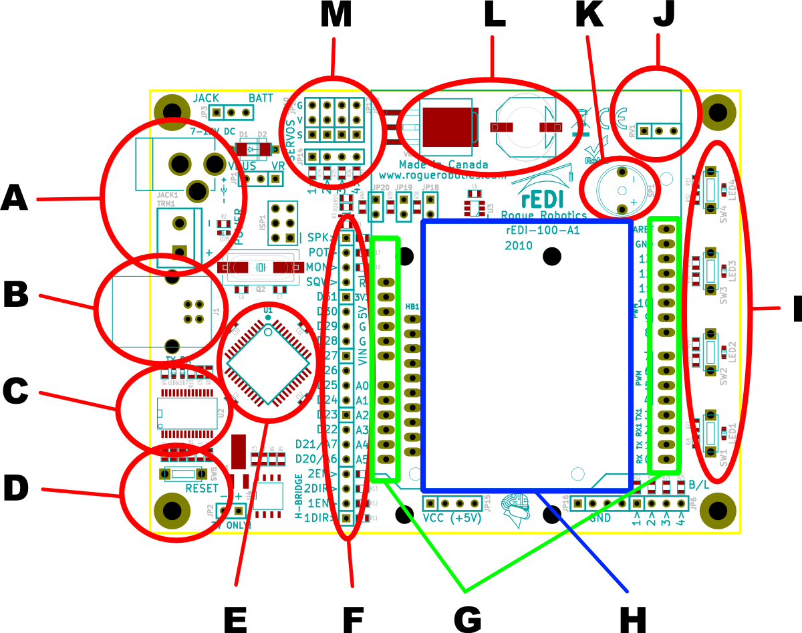



  * **A**: 2.1 mm DC adapter jack, and screw-down battery terminals.
  * **B**: USB A Jack.
  * **C**: FTDI FT232RL USB to serial converter.
  * **D**: Easy-access reset switch.
  * **E**: ATmega644P microcontroller.
  * **F**: D20 → D31 pin break-out.
  * **G**: Arduino(tm) shield headers.
  * **H**: Breadboard.
  * **I**: 4 x Switch/LED combo.
  * **J**: 10 kOhm thumb wheel trim-pot.
  * **K**: Piezo speaker.
  * **L**: LM1084 - 5 amp 5 volt regulator.
  * **M**: 4 x PWM controlled servo headers.
