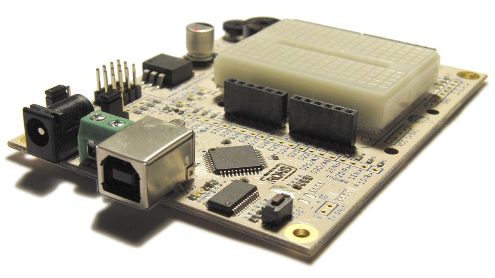




[{: width="400px"}](photos.html)

**Current Hardware Version: rEDI-100 (A1)**

  * rEDI Product Page - Discontinued
  * [Libraries/Projects/Examples]({{ base_path }}/code/)
  * [GC Downloads](http://code.google.com/p/rogue-code/downloads/list?can=1&q=Tag-rDuino) (Arduino(tm) IDE hardware core)

**Note:** This documentation is outdated, and is here for reference only. We no longer manufacture the rEDI Educational/Prototyping Board.
{: .notice--warning}

## Documentation

  * [Downloads & Installation](downloads.html)
  * [Features](features.html)
  * [Overview](overview.html)
  * [Details](details.html)
  * [Schematic](schematic.html)
  * [Connectors and Components](connectors_and_components.html)
  * [Pin Mapping](pin_mapping.html)
