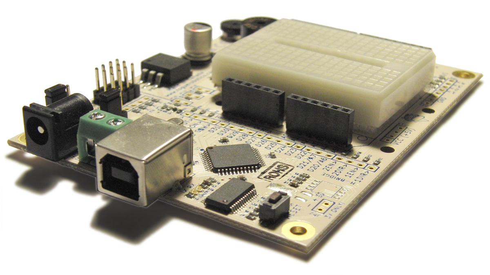
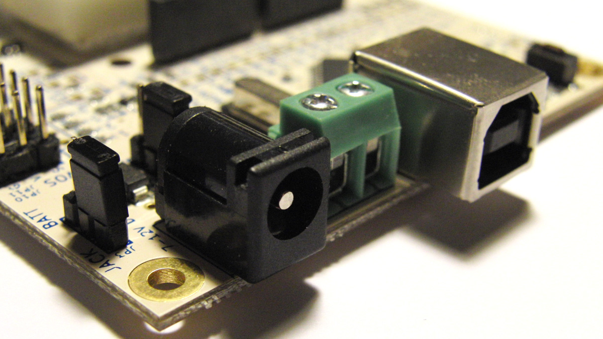
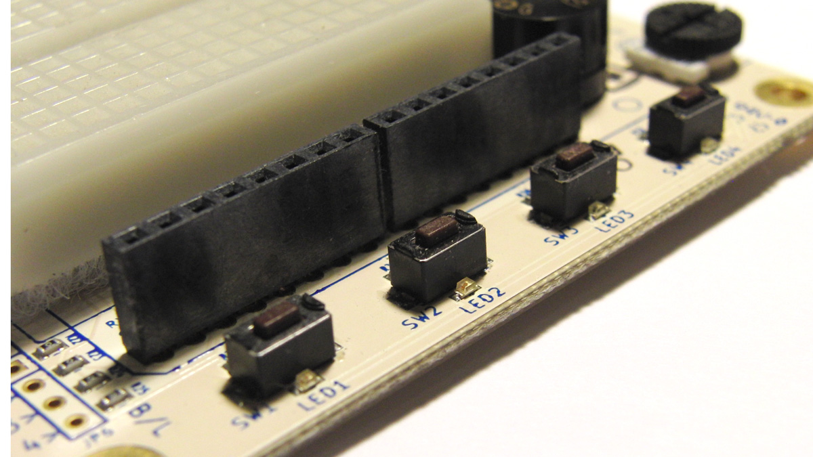
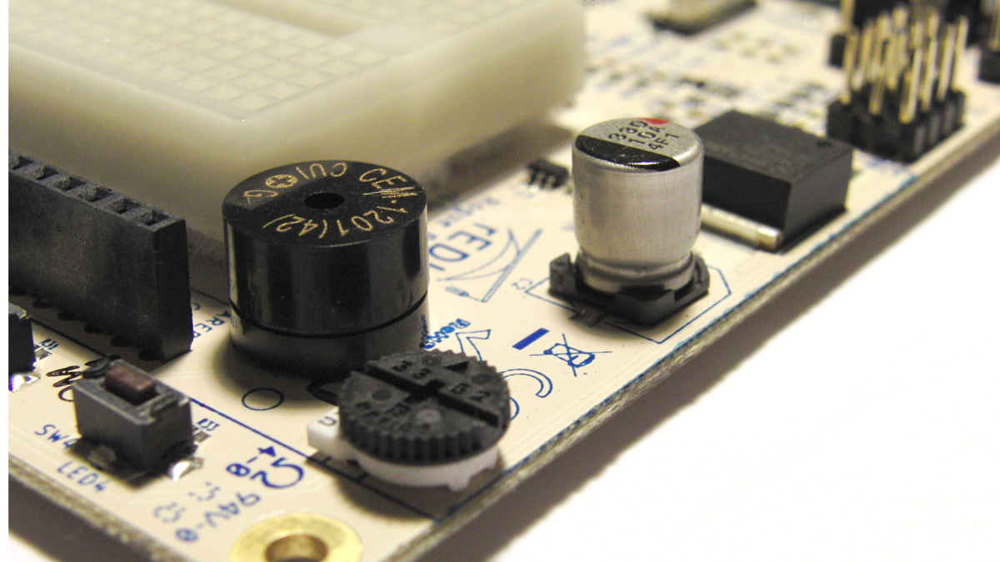
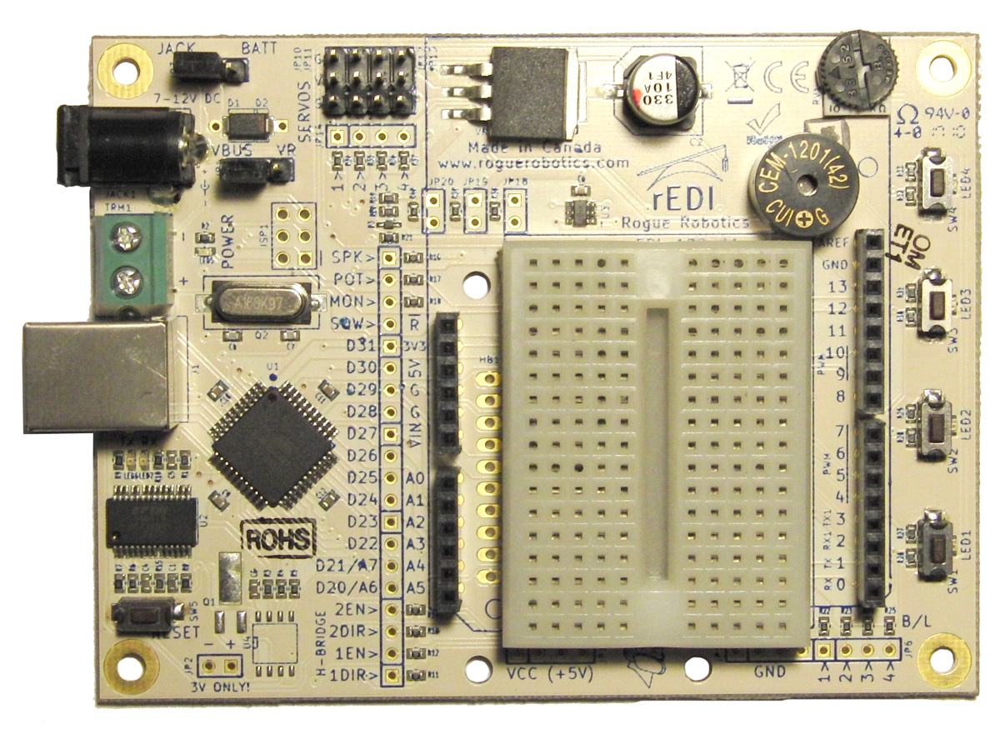




The rEDI Educational Board is a microcontroller board based on the ATmega644P. It has 32 digital input/output pins (of which 6 can be used as PWM outputs), 8 analog inputs, a 16 MHz crystal oscillator, 4 PWM controlled servo headers, 4 switch/led combos, a piezo speaker, a 10 kOhm thumb wheel trim-pot, a breadboard, and a reset button. It contains everything needed to support the microcontroller; simply connect it to a computer with a USB cable or power it with a AC-to-DC adapter or battery to get started.

## Power and USB Connectors

  * Selectable USB/Power regulator power source.
    * NOTE: USB power source is limited to 500 mA.
  * 2.1 mm power jack.
  * Battery pack screw-down terminals.
  * USB A jack.

## Switch LED Combos

  * 4 color LEDs: green, yellow, red, blue.
  * 4 momentary switches.
  * Single digital pin used for each switch/LED combo.

## Other Components

  * Piezo speaker.
  * 10 kOhm thumb wheel trim-pot.
  * 5 amp 5 volt regulator.

  * Arduino(tm) Shield headers.
  * Breadboard.
  * Easy-access reset switch.
