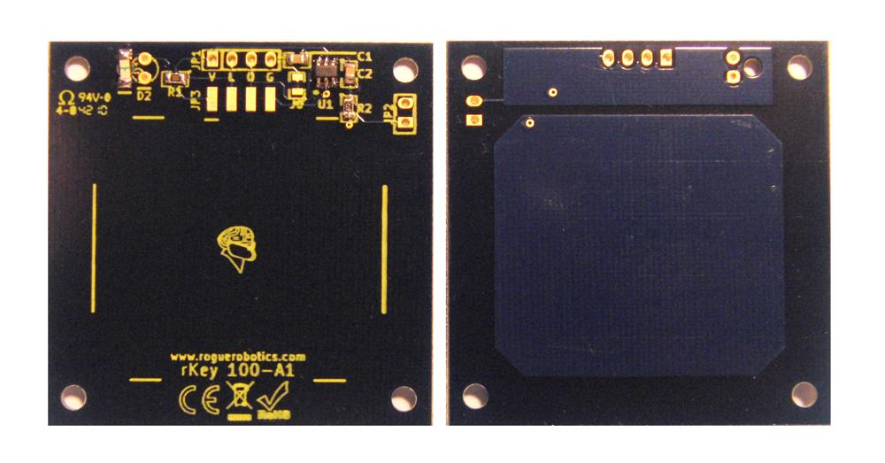




[{: width="400"}](photos.html)

**Current Hardware Version**

| Hardware Version | Latest Revision |
|:-----------------|:----------------|
| rKey-100 (1")    | 100-A1          |
| rKey-200 (2")    | 110-A1          |

Below are some resources for the rKey Capacitive Touch Key Module.

  * [rKey Product Page](http://www.roguerobotics.com/products/rkey)

## Documenation

  * [Features](features.html)
  * [Overview](overview.html)

### Specifications and Standards

  * [Electrical Characteristics](electrical_characteristics.html)
  * [Timing Characteristics](timing_characteristics.html)
  * [Mechanical Drawing](mechanical_drawing.html)

### Connectors

  * [Connector](connectors.html)
