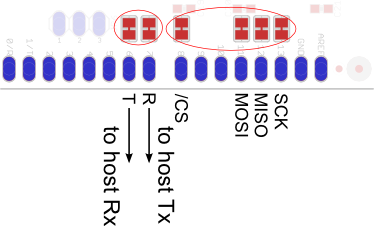
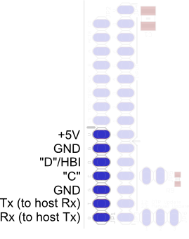
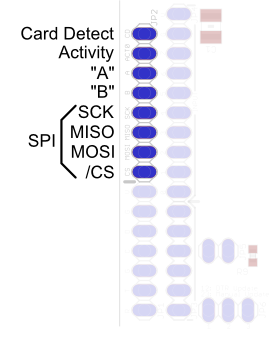
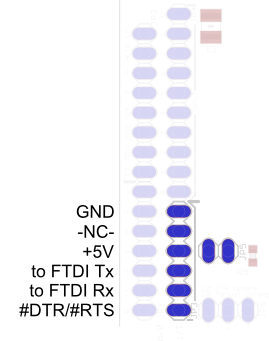
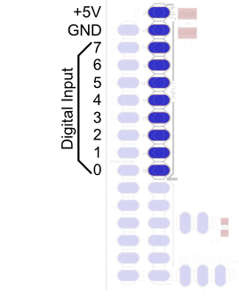




## Arduino Connector

The default connections for the Arduino Connector are as follows:

  * **Serial**
    * Pin 6: Serial receive on Arduino, transmit on rMP3
    * Pin 7: Serial transmit on Arduino, receive on rMP3
  * **SPI**
    * Pin 8: SPI chip select ({{ base_path }}/CS - active low)
    * Pin 11: SPI MOSI (Master Output, Slave Input)
    * Pin 12: SPI MISO (Master Input, Slave Output)
    * Pin 13: SPI SCK (SPI Clock)

All of these pins have an associated jumper pad just beside the connector which you can use to reroute the signal.  You will need to physically cut the jumper between the pads.

You only need to use one of the two interfaces at a time (i.e. serial vs. SPI).

**INFO:** The SPI interface is not available in rMP3 firmware version 100.01.
{: .notice--info}

## Rogue Connector 1

|  JP1  |  |
|:------|:-|
|**Name**  |**Function**  |
|------|----------|
|+5V   |5 Volt Regulated Power Supply  |
|GND   |Ground                         |
|"D"/HBI  |Multipurpose "D" connection Hardware Busy Indicator  |
|"C"   |Multipurpose "C" connection    |
|GND   |Ground                         |
|Tx    |rMP3 Serial Transmit           |
|Rx    |rMP3 Serial Receive            |

## Rogue Connector 2

|  JP2  |   |
|:------|:-|
|**Name**  |**Function**  |
|------|----------|
|Card Detect  |Card Detect Signal (active low)  |
|Activity     |Activity Signal (from Activity LED)  |
|"A"          |Multipurpose "A" signal (from "A" LED)  |
|"B"          |Multipurpose "B" signal (from "B" LED)  |
|SCK          |Slave SPI Serial Clock  |
|MISO         |Slave SPI MISO (Master Input, Slave Output  |
|MOSI         |Slave SPI MOSI (Master Output, Slave Input  |
|/CS          |Slave SPI Chip Select (active low)  |

## FTDI Cable Connector

|  JP3  ||
|:------|:-|
|**Name**  |**Function**  |
|------------|----------|
|GND         |Ground  |
|-NC-        |No Connection  |
|+5V         |5 Volt Supply from FTDI connector - to use this supply, JP5 must be jumped  |
|to FTDI Tx  |Serial transmit on FTDI connector, receive on rMP3  |
|to FTDI Rx  |Serial receive on FTDI connector, transmit on rMP3  |
|#DTR/#RTS   |DTR/RTS signal from FTDI connector (active low)  |

## Input Connector

|  JP4  ||
|:------|:-|
|**Name**  |**Function**  |
|------|----------|
|+5V   |5 Volt Regulated Power Supply  |
|GND   |Ground  |
|7     |Button 7 7 Bit Interface Trigger (active low)  |
|6     |Button 6 Bit 6  |
|5     |Button 5 Bit 5  |
|4     |Button 4 Bit 4  |
|3     |Button 3 Bit 3  |
|2     |Button 2 Bit 2  |
|1     |Button 1 Bit 1  |
|0     |Button 0 Bit 0  |

## Line-Out Connector

|  JP7  ||
|:------|:-|
|**Name**  |**Function**  |
|------|----------|
|V  |5 Volt Regulated Power Supply  |
|R  |Right audio output (1V p/p, 16 Ohm minimum)  |
|G  |Ground  |
|L  |Left audio output (1V p/p, 16 Ohm minimum)  |

## Other Connectors

### JP5

When JP5 is jumped, the FTDI connector will be used as the power supply for the board.

***WARNING:*** JP5 must not be jumped if the FTDI connector is used at the same time as another external supply is connected.
{: .notice--danger}

### JP6

JP6 is used when updating the firmware.  The "Manual Update" mode is recommended.  This will put the rMP3 into bootloader mode.

### DNU

The DNU connector is used for manufacturing only.
