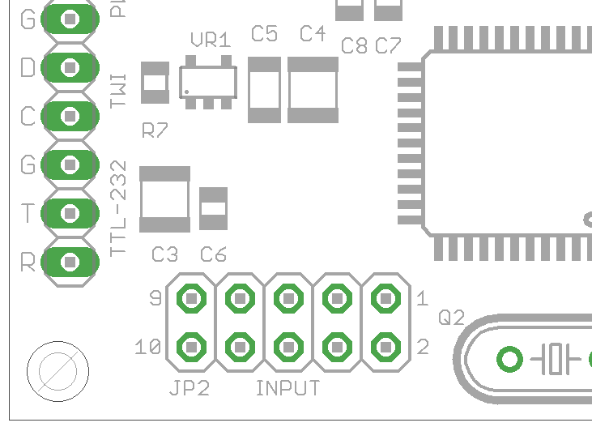




The uMP3 has a multipurpose 8 bit interface for controlling the module without using the serial interface.  The input connector is labeled "JP2" as well as "INPUT".

## Input Connector



|  Pin  |  Description     |
|-------|------------------|
|  1    |Button 0/Bit 0    |
|  2    |Button 1/Bit 1    |
|  3    |Button 2/Bit 2    |
|  4    |Button 3/Bit 3    |
|  5    |Button 4/Bit 4    |
|  6    |Button 5/Bit 5    |
|  7    |Button 6/Bit 6    |
|  8    |Button 7/Trigger  |
|  9    |Ground (GND)      |
|  10   |Vcc (+5V)         |

## Input Styles

There are two different styles for the Input Interface:

* 8 Button/Switch Mode
* 7 Bit Parallel Mode

Audio files are played from MMC/SD card, and the files must be located in the top level folder/directory.

### 8 Button/Switch Mode

The 8 Switch mode allows each of the 8 data bits of the Input Interface to be
used as a trigger for 8 different files.

Pin 1 plays a file named `B0000.MP3`. Pin 2 plays a file named `B0001.MP3`.
and so on.

To set the Input interface into 8 Button/Switch Mode, you need to configure the uMP3
using the Settings "[Input Style]({{ base_path }}/documentation/common/settings.html#input-style)" command. The style value for 8 Button/Switch Mode is
"1". Once the setting has been configured, it is stored in EEPROM, and does not
have to be set again. You can reconfigure it at any time, or clear the settings to
default values by putting the uMP3 into "update mode".

Once in 8 Button/Switch Mode, all pins of the Input Interface are weakly pulled high internally. To trigger playback of a file, the associated switch must be pulled to ground or VCC (depending on the "[Input Polarity]({{ base_path }}/documentation/common/settings.html#input-polarity-control)").

***IMPORTANT:*** If the polarity for a given pin is positive, you must use a pull-down (say 47K Ω) to ground on that pin.
{: .notice--warning}

|Input Pin  |Bit/Switch  |Associated Filename  |
|-----------|------------|---------------------|
|  1        |  0         |B0000.MP3            |
|  2        |  1         |B0001.MP3            |
|  3        |  2         |B0002.MP3            |
|  4        |  3         |B0003.MP3            |
|  5        |  4         |B0004.MP3            |
|  6        |  5         |B0005.MP3            |
|  7        |  6         |B0006.MP3            |
|  8        |  7         |B0007.MP3            |

All files are stored in the root directory of the MMC/SD card.

### 7 Bit Parallel Mode

The 7 Bit Parallel mode provides a 7 bit file selection interface. Pins 1 through 7
(bits 0 through 6) will have the file number applied, and Pin 8 (bit 7) will trigger
playback.

In this mode, a file number of 0 plays a file named `N0000.MP3`. A file number
of 1 plays a file named `N0001.MP3` and so on.

To set the Input Interface into 8 Button/Switch Mode, you need to configure the uMP3
using the Settings "[Input Style]({{ base_path }}/documentation/common/settings.html#input-style)" command. The style value for 7 Bit Parallel Mode is
"2". Once the setting has been configured, it is stored in EEPROM, and does not
have to be set again. You can reconfigure it at any time, or clear the settings to
default values by putting the uMP3 into "update mode".

Once in 7 Bit Parallel Mode, all pins of the Input Interface are weakly pulled high
internally. The Input Interface can be connected to a port on microcontroller. The lower 7 pins are read as noninverted.  That is, if you want to play file number "7", the lower 7 Input pins would be
"0000111". The trigger on pin 8 will start playback when its value goes from high
to low (falling edge triggered).

The trigger pin is not debounced, so a capacitor/resistor debounce circuit may be
needed if the trigger pin is connected directly to a switch.

|  Value on Pins 1 through 7  |  Binary Value <br />Bit 6 … Bit 0  |  Hexadecimal Value  |Associated Filename  |
|-----------------------------|--------------------------------------|---------------------|---------------------|
|  0    |  000 0000  |  00   |N0000.MP3  |
|  1    |  000 0001  |  01   |N0001.MP3  |
|  2    |  000 0010  |  02   |N0002.MP3  |
|  ...  |  ...       |  ...  |...        |
|  42   |  010 1010  |  2A   |N0042.MP3  |
|  43   |  010 1011  |  2B   |N0043.MP3  |
|  ...  |  ...       |  ...  |...        |
|  126  |  111 1110  |  7E   |N0126.MP3  |
|  127  |  111 1111  |  7F   |N0127.MP3  |

Just the same as with the 8 Switch Mode, you can use the Settings **Input File
Number Offset** setting to introduce an offset to the filenames. This allows
you to create "banks" of associated playback files.


## Input Interface Settings

To change how the Input Interface works, you can change the settings using the [Settings Command]({{ base_path }}/documentation/common/commands/settings.html).

### Input File Number Offset

Setting name: `N`

Sets the offset for the filenames used for the input interface.  For example, if the 8 Button/Switch mode is being used, and the **Input File Number Offset** is set to 200, then all filenames will be offset by 200.  i.e. The filename for button/switch 2 will be `B0202.MP3`.

You can use **Input File Number Offset** setting to introduce an offset to the filenames associated with each switch. This allows you to create "banks" of files to associate with the buttons/switches.

The range for the **Input File Number Offset** can be anywhere from 0 to 9872.

**Why 9872?**
9872 + 127 = 9999.  (i.e. N9999.MP3 is the MAX for 7 Bit Mode file number 127 with offset 9872)
{: .notice }

### Input Non-stop Control

Setting name: `U`

In 8 Button/Switch mode, this 8 bit mask indicates which buttons will be considered non-stop (a 1 in the mask indicates non-stop). In 7 Bit mode, anything > 0 will indicate non-stop playback.

This is an 8 bit mask.  For example, to make button/switch 5 and 2 non-stop:

```
0b00100100 = 0x24 = 36 (decimal)

ST U 36
```

### Input Polarity Control

Setting name: `A`

Used only in 8 Button/Switch mode, this 8 bit mask indicates the polarity of input for each individual input pin (a 1 in the mask indicates positive edge triggering).

This is an 8 bit mask.  For example, to make buttons/switches 3 through 0 positive triggered (make sure you use pull-downs on these buttons/switches):

```
0b00001111 = 0x0F = 15 (decimal)

ST A 15
```

### Switch Input Debounce Mode

Setting name: `M`

Used only in 8 Button/Switch mode, this setting will turn on a simple 40 ms debounce algorithm for the inputs.

Change this setting to `1` to enable the debounce algorithm.


## Tips and Tricks

  * To stop playback of a file in the 8 Button/Switch mode, have one button/switch file missing (for example, `B0007.MP3`), and trigger that file.  The currently playing file will stop (unless you've set **Non-Stop Control** for that pin).  The same applies for 7 Bit Mode.  E.g. make sure `N0127.MP3` is missing, and trigger that file to stop playback.

