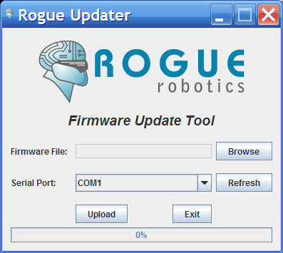




The uMMC, uMP3, and rMP3 have the capability to have their firmware updated.  This is done through the serial connection to the module.  You need to put the module into it's "Update Mode" which usually is done by shorting the UPD pads on the module, or in the case of the rMP3, by shorting pins 2 & 3 of JP6.  Once the module is in "Update Mode", you can use the Rogue Robotics Firmware Update Tool - Rogue Updater - to upload new firmware to the module.



## Download

### Rogue Updater

Download and unzip the Rogue Updater tool to a folder.

You can download the tool from here: [Rogue Updater](http://code.google.com/p/rogue-code/downloads/list?q=RogueUpdater)

(NOTE: You may have to install `librxtx-java` on some linux versions, e.g. Ubuntu - use `sudo apt-get install librxtx-java` from a terminal window to install the RXTX library.)

### Firmware

Download and unzip the firmware for your module to a folder.

Download the firmware for your module here: [Firmware Downloads](http://code.google.com/p/rogue-code/downloads/list?q=firmware)

## Connection

You can use either a USB to TTL Serial converter (e.g. FTDI USB to Serial cable), or use an Arduino or other type of compatible board that has a built-in USB to serial converter.

### USB to TTL Serial

Connect the TX on the USB to TTL Serial converter to the "R" pin on the module (rMP3, uMMC, uMP3), and connect the RX on the USB to TTL Serial converter to the "T" pin on the module.

|USB to TTL Serial Pin  |  rMP3 pin    |  uMP3 pin  |  uMMC pin  |
|-----------------------|--------------|------------|------------|
|  TX                   |  "R" on JP1  |  "R"       |  "R"       |
|  RX                   |  "T" on JP1  |  "T"       |  "T"       |
|  Ground (GND)         |  "G" on JP1  |  "G"       |  "G"       |
|  +5 V (optional)      |  "V" on JP1  |  "V"       |  "V"       |

Make sure you connect the ground (GND) from the USB to TTL Serial converter to the "G" pin on the module, as well.

The 5 Volt power supply can come from any source - e.g. from the converter, or from another source.

### Using an "Arduino" or compatible board

Load this sketch onto your Arduino board:

`ArduinoKill.pde`

```cpp
void setup(void)
{
  Serial.end();  // This isn't absolutely necessary, but hey, why not?
}

void loop(void)
{
}
```

Now use two wires to connect **pin 0** to **pin 7** (rMP3) or "T" (uMMC or uMP3), and **pin 1** to **pin 6** (rMP3) or "R" (uMMC or uMP3).

## Enable Update Mode

Now, put the module into "Update Mode":

  * [uMMC Update Mode instructions]({{ base_path }}/documentation/ummc/update_mode.html)
  * uMP3 - similar to uMMC (see above)
  * rMP3 - short pins 2 & 3 on JP6

## Upload

Start the Rogue Updater tool, by starting "RogueUpdater.jar" on your system.

Select the firmware file (*.rfw) by clicking the "Browse" button, and find the file in the folder to where you unzipped the firmware for your module.

Select the serial port to which the module is connected by using the pull-down list beside "Serial Port".  If you connected the serial port after you started the Rogue Updater, you can click "Refresh" to refresh the list of available serial ports.

Click "Upload" to begin the firmware upload and watch the progress bar at the bottom.  When it reaches 100%, the firmware has been uploaded.  You can click "Exit" or continue to upload the firmware to more modules.

## Mac OS notes

You may get this error message: `java.lang.NoClassDefFoundError: javax/swing/filechooser/FileNameExtensionFilter`

What you'll need to do is ensure you have Java 1.6 installed, then to set it as the default, open Java Preferences in Applications → Utilities → Java and drag Java SE 6.0 to the top of each table shown.  That’s it.

